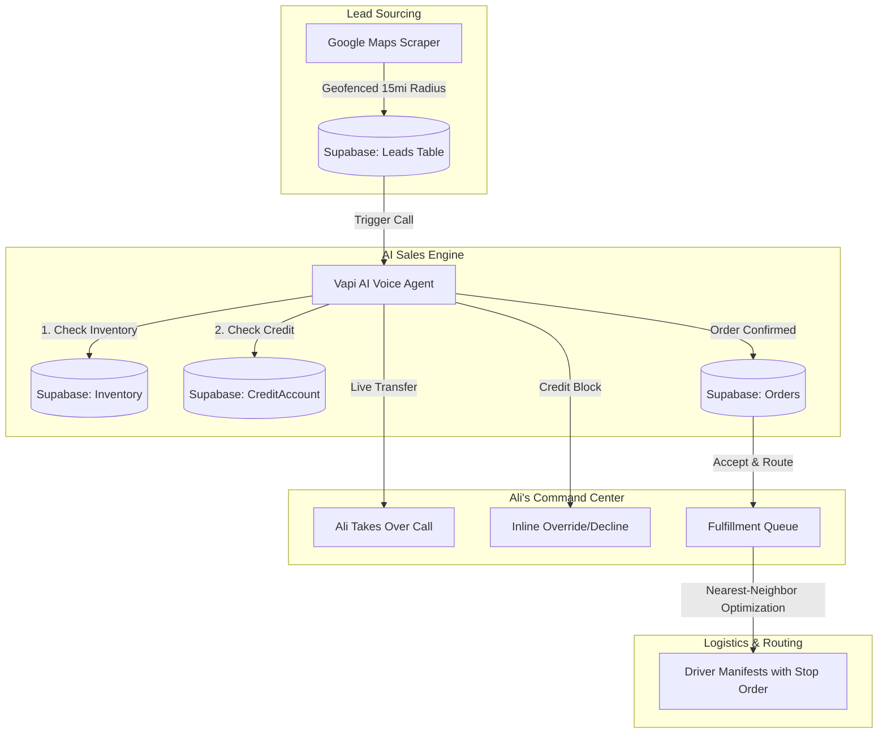
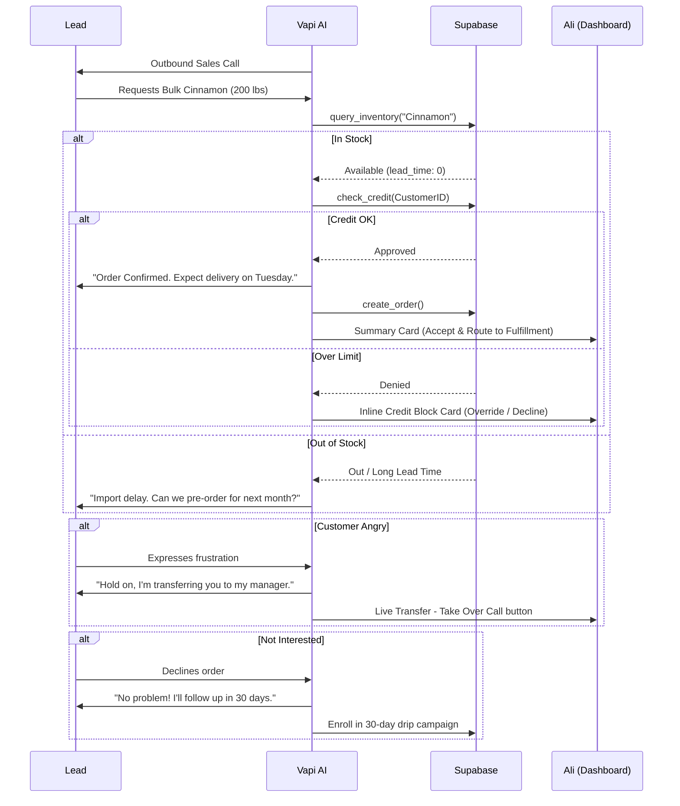

# System Architecture: Ali's Automated Wholesale Distributor

## Executive Summary
This architecture defines a highly automated, AI-driven wholesale distribution system designed for a dry-bulk distributor (Raisins, Cinnamon, Seeds, Nuts) operating in Western Long Island. The system automates the lead-to-delivery lifecycle by integrating AI voice agents (Vapi), a robust backend (Supabase), and optimized logistics (Google Maps Routing API). Ali's dashboard serves as a **real-time command center** where the AI handles routine calls autonomously and interrupts Ali inline only when human judgment is required.

## 1. Core Technology Stack
*   **Database & Backend**: [Supabase](https://supabase.com) (PostgreSQL, Edge Functions, Auth, Real-time).
*   **AI Voice Sales**: [Vapi](https://vapi.ai) (LLM-driven outbound calling with deep Supabase integration).
*   **Logistics & Routing**: [Google Maps Routing API](https://developers.google.com/maps/documentation/routes) (Route density optimization).
*   **Automated Drips & Tasks**: [Zapier](https://zapier.com) (Post-call CRM updates and notifications).
*   **Lead Sourcing**: Custom Google Maps Scraper + Geofencing logic.

---

## 2. System Architecture & Data Flow

### 2.1 Technical System Overview
The system is built to be "Queue-Ready." While initial volumes (50-100 calls/day) are handled by Supabase Edge Functions, the data model supports an asynchronous job queue for future scale.

### 2.2 Detailed Order Sequence
The AI agent performs real-time validation before confirming any transaction.

---

## 3. Component Details

### 3.1 AI Sales Logic & Validation
The Vapi agent is configured with dynamic tools to interact with Supabase:
*   `check_stock`: Verifies real-time levels of dry bulk goods.
*   `check_credit`: Returns `limit_check = true` for new leads (COD) or verifies existing balances for established accounts.

### 3.2 Dashboard Design Philosophy: Inline Interrupts over Action Queues
The dashboard is designed for **Ali** (the human operator), not the AI agent. Rather than routing escalations to a separate "Action Required" tab where problems sit in a queue, the system uses **real-time inline interrupts** directly in the call flow:

1.  **Angry Customer → Live Transfer**: When the AI detects negative sentiment, it tells the customer *"Hold on, I'm transferring you to my manager"* and presents Ali with a pulsing **"Take Over Call"** button in the Vapi HUD. Ali picks up immediately — no tab-switching, no delay.
2.  **Credit Limit Exceeded → Inline Decision Card**: The HUD shows the financial breakdown (credit limit, outstanding balance, order amount, new total) with two action buttons: **"Override & Approve Order"** or **"Decline Order."** Ali decides on the spot.
3.  **Successful Order → Accept & Route to Fulfillment**: Orders flow directly into the Fulfillment tab with automatic route assignment and stop ordering.
4.  **Not Interested → Automatic Drip Enrollment**: The AI gracefully ends the call and auto-enrolls the lead into a 30-day follow-up drip campaign.

**Why no Action Required tab?** A separate escalation queue creates a passive workflow where problems accumulate. Inline interrupts ensure Ali addresses issues in real-time while the customer is still on the line.

### 3.3 Human-in-the-Loop (HITL) Triggers
The system automatically breaks the automation loop and presents Ali with inline action cards under the following conditions:
1.  **Negative Sentiment**: If the AI detects frustration, it initiates a **live transfer** — telling the customer "I'm transferring you to my manager" and giving Ali a "Take Over Call" button.
2.  **Credit Issues**: Established customers exceeding their `CreditAccount` limit trigger an inline **Override/Decline** card with full financial details.
3.  **Volume Threshold**: Any order or projected volume **> 500 lbs/month**.
4.  **Strategic Clients**: Leads identified as **Commercial Bakery Chains** or multi-location entities.
5.  **Complex Pricing**: Request for **"Wholesale Pricing Tiers"** beyond the standard AI script.

### 3.4 Fulfillment & Route Optimization
Once Ali accepts an order, it flows into the **Fulfillment tab** with:
*   **Automatic Route Assignment**: Orders are grouped by territory (e.g., Mineola Loop, Garden City Loop) based on the lead's geographic cluster.
*   **Nearest-Neighbor Stop Ordering**: Stops within each route are optimized using a nearest-neighbor algorithm starting from HQ, minimizing total drive time.
*   **Refresh Routes Button**: When new bakeries are added to a route, Ali can click **"Refresh Routes"** to recalculate the optimal stop order across all stops.
*   **Truck Capacity Tracking**: Each route displays cumulative weight against the truck's 2,500 lb capacity limit.
*   **Strategy**: Order batching by zip code clusters within the 15-mile radius.
*   **Constraint**: Optimization logic minimizes "total idle time" on the Long Island Expressway (LIE).

### 3.5 Dashboard Tabs
The dashboard uses three focused tabs:
| Tab | Purpose | Content |
|---|---|---|
| **Incoming** | Leads waiting to be called | Lead cards with phone buttons, predicted volume, territory |
| **Fulfillment** | Accepted orders ready for delivery | Route cards with stop ordering, weight tracking, refresh button |
| **Drip** | Leads enrolled in follow-up campaigns | Lead cards with next contact date and channel |

---

## 4. Implementation Roadmap

### Phase 1: 6-Month MVP (50-100 calls/day)
*   **Month 1-2**: Lead Scraping & Supabase Schema Setup (Leads, Inventory, CreditAccounts, Campaigns, Drivers).
*   **Month 3**: Vapi Scripting & Tool Integration (Real-time stock/credit check, live transfer).
*   **Month 4**: Automated Order Processing & Zapier Drips (30-day follow-up campaigns).
*   **Month 5**: Fulfillment Queue with Nearest-Neighbor Route Optimization.
*   **Month 6**: Ali's Command Center Dashboard & End-to-End Testing.

### Phase 2: Scale & Deferred Features
*   **Complex Logistics**: Bridge height and weight-sensitive routing for heavy trucks.
*   **Global Expansion**: Plugging in BullMQ/Redis for multi-city scaling.
*   **Predictability**: AI forecasting based on harvest seasons and shipping lead times from India.
*   **Dynamic Pricing**: Algorithmic pricing tiers based on real-time commodity fluctuations.

---

## 5. Security & Availability
*   **Data Integrity**: Supabase RLS (Row Level Security) ensures only authorized AI triggers can modify inventory.
*   **Fault Tolerance**: If Vapi disconnects, the state is preserved in Supabase, allowing Ali to resume from the last transcript via the dashboard.
*   **Live Transfer Safety**: If Ali doesn't pick up within 60 seconds, the AI gracefully tells the customer "My manager will call you back shortly" and creates a callback task.
