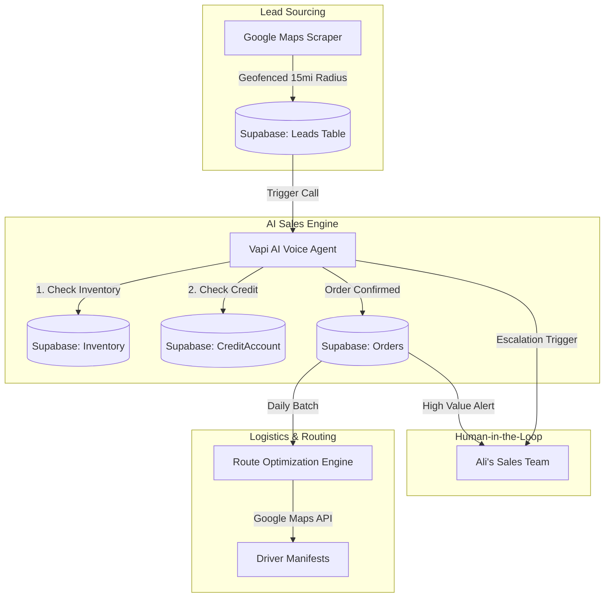
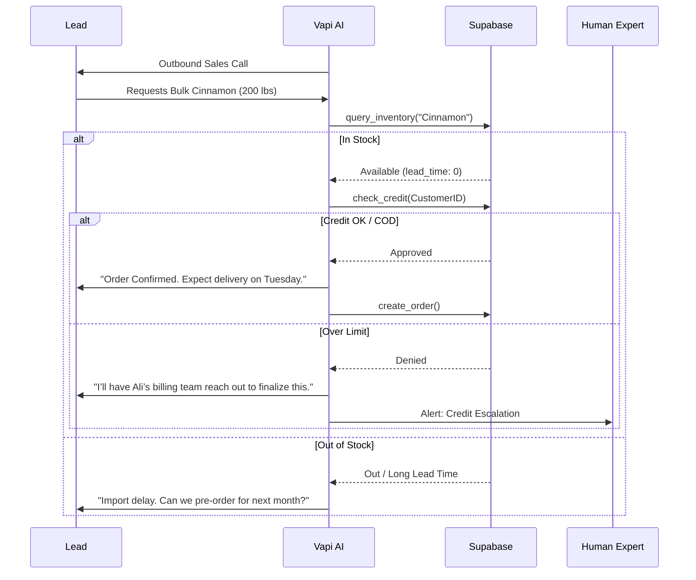

# System Architecture: Ali's Automated Wholesale Distributor

## Executive Summary
This architecture defines a highly automated, AI-driven wholesale distribution system designed for a dry-bulk distributor (Raisins, Cinnamon, Seeds, Nuts) operating in Western Long Island. The system automates the lead-to-delivery lifecycle by integrating AI voice agents (Vapi), a robust backend (Supabase), and optimized logistics (Google Maps Routing API).

## 1. Core Technology Stack
*   **Database & Backend**: [Supabase](https://supabase.com) (PostgreSQL, Edge Functions, Auth, Real-time).
*   **AI Voice Sales**: [Vapi](https://vapi.ai) (LLM-driven outbound calling with deep Supabase integration).
*   **Logistics & Routing**: [Google Maps Routing API](https://developers.google.com/maps/documentation/routes) (Route density optimization).
*   **Automated Drips & Tasks**: [Zapier](https://zapier.com) (Post-call CRM updates and notifications).
*   **Lead Sourcing**: Custom Google Maps Scraper + Geofencing logic.

---

## 2. System Architecture & Data Flow

### 2.1 Technical System Overview
The system is built to be "Queue-Ready." While initial volumes (50-100 calls/day) are handled by Supabase Edge Functions, the data model supports an asynchronous job queue for future scale.

### 2.2 Detailed Order Sequence
The AI agent performs real-time validation before confirming any transaction.

---

## 3. Component Details

### 3.1 AI Sales Logic & Validation
The Vapi agent is configured with dynamic tools to interact with Supabase:
*   `check_stock`: Verifies real-time levels of dry bulk goods.
*   `check_credit`: Returns `limit_check = true` for new leads (COD) or verifies existing balances for established accounts.

### 3.2 Human-in-the-Loop (HITL) Triggers
The system automatically breaks the automation loop and alerts Ali's team under the following conditions:
1.  **Volume Threshold**: Any order or projected volume **> 500 lbs/month**.
2.  **Strategic Clients**: Leads identified as **Commercial Bakery Chains** or multi-location entities.
3.  **Sentiment Safeguard**: If LLM detects frustration (sentiment score **< 0.3**).
4.  **Complex Pricing**: Request for **"Wholesale Pricing Tiers"** beyond the standard AI script.
5.  **Credit Issues**: Established customers exceeding their `CreditAccount` limit.

### 3.3 Logistics: Route Density Optimization
Instead of simple point-to-point routing, the system prioritizes "Route Density" to maximize driver efficiency in the high-traffic Long Island area.
*   **Strategy**: Order batching by zip code clusters within the 15-mile radius.
*   **Constraint**: Optimization logic minimizes "total idle time" on the Long Island Expressway (LIE).
*   **Vessels**: Standard commercial van/truck limits assigned for MVP.

---

## 4. Implementation Roadmap

### Phase 1: 6-Month MVP (50-100 calls/day)
*   **Month 1-2**: Lead Scraping & Supabase Schema Setup (Leads, Inventory, CreditAccounts).
*   **Month 3**: Vapi Scripting & Tool Integration (Real-time stock/credit check).
*   **Month 4**: Automated Order Processing & Zapier Drips.
*   **Month 5**: Basic Google Maps Batch Routing (Zip Cluster Optimization).
*   **Month 6**: HITL Alerting Dashboard & Testing.

### Phase 2: Scale & Deferred Features
*   **Complex Logistics**: Bridge height and weight-sensitive routing for heavy trucks.
*   **Global Expansion**: Plugging in BullMQ/Redis for multi-city scaling.
*   **Predictability**: AI forecasting based on harvest seasons and shipping lead times from India.
*   **Dynamic Pricing**: Algorithmic pricing tiers based on real-time commodity fluctuations.

---

## 5. Security & Availability
*   **Data Integrity**: Supabase RLS (Row Level Security) ensures only authorized AI triggers can modify inventory.
*   **Fault Tolerance**: If Vapi disconnects, the state is preserved in Supabase, allowing a human agent to resume from the last transcript.
