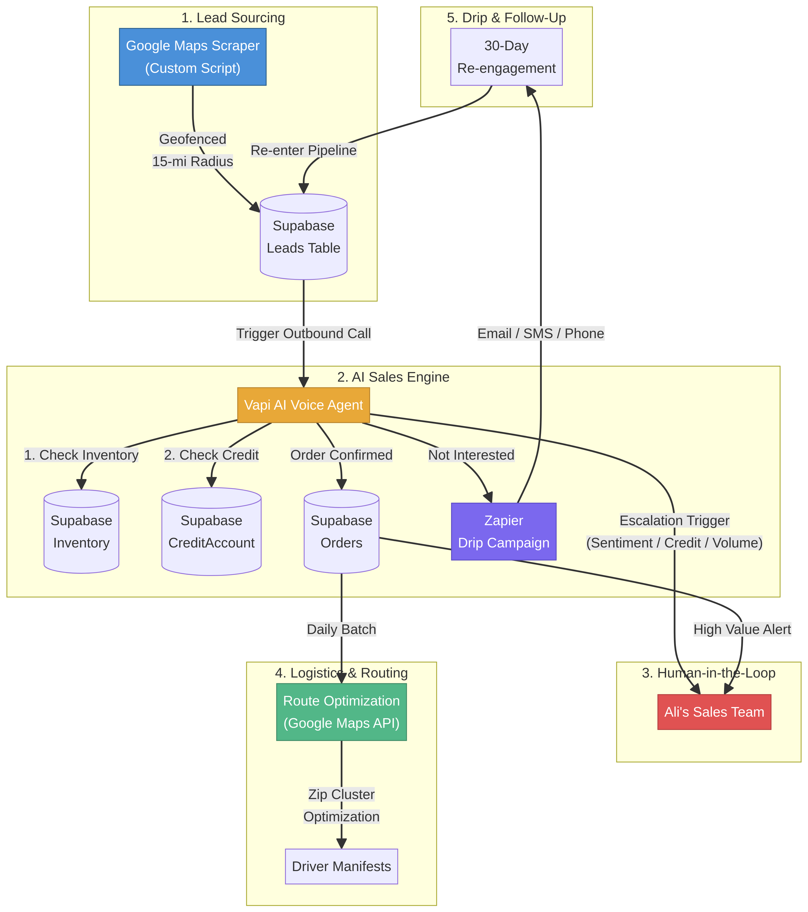
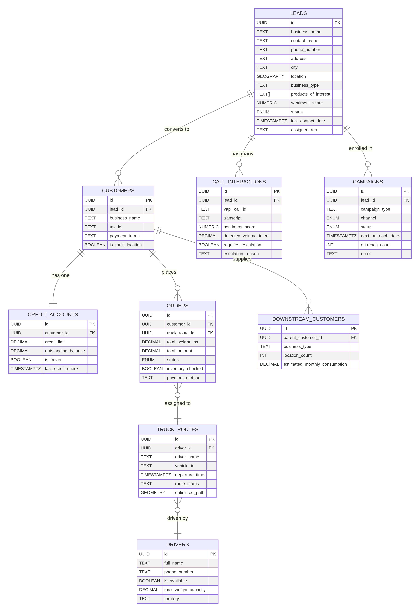
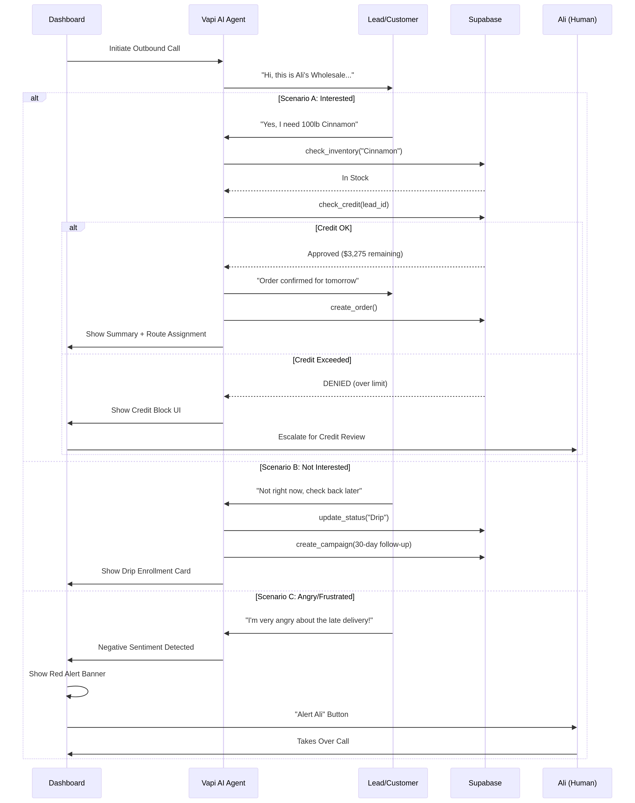
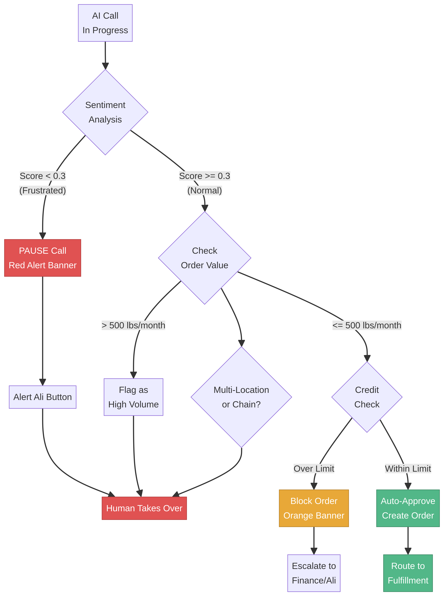
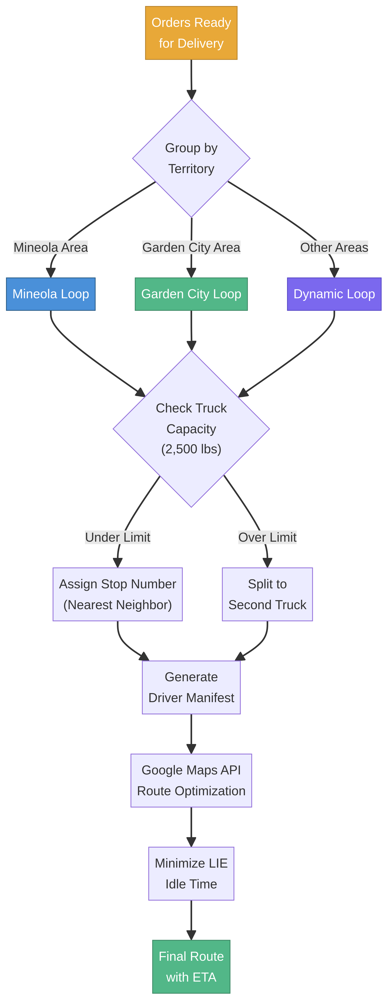
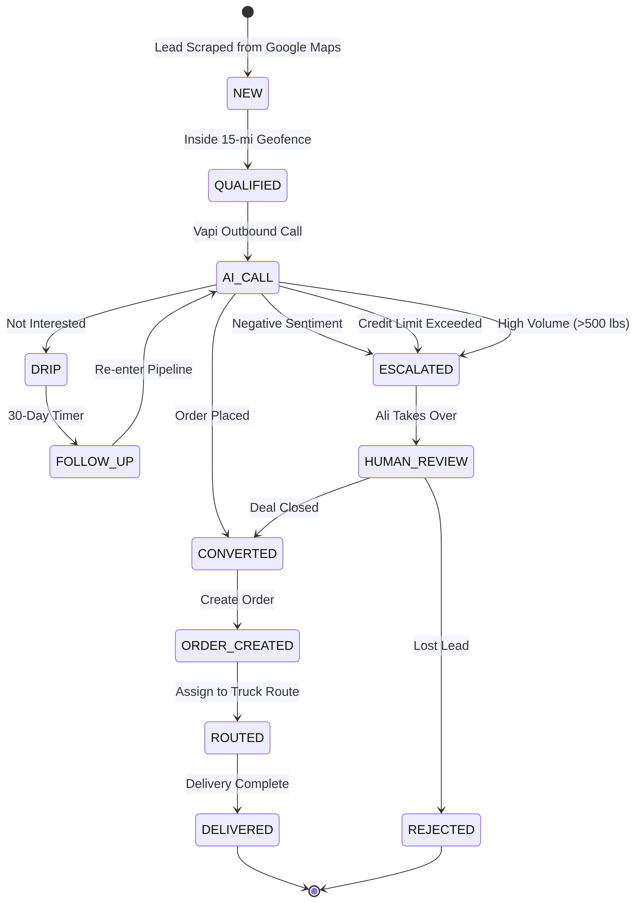
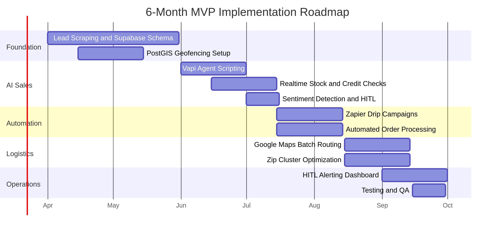

# Ali Wholesale SaaS: Interview Preparation Guide

**Candidate Prep Document** | AI-Powered Wholesale Sales and Delivery Workflow

---

## Table of Contents

1. [Executive Summary](#1-executive-summary)
2. [Problem Framing and MVP Definition](#2-problem-framing-and-mvp-definition)
3. [System Architecture](#3-system-architecture)
4. [Data Model](#4-data-model)
5. [AI Call Workflow](#5-ai-call-workflow)
6. [Business Scenario Walkthroughs](#6-business-scenario-walkthroughs)
7. [Human-in-the-Loop Escalation Logic](#7-human-in-the-loop-escalation-logic)
8. [Delivery Routing and Logistics](#8-delivery-routing-and-logistics)
9. [Lead Lifecycle State Machine](#9-lead-lifecycle-state-machine)
10. [6-Month Implementation Roadmap](#10-6-month-implementation-roadmap)
11. [Technical Decisions and Tradeoffs](#11-technical-decisions-and-tradeoffs)
12. [Anticipated Interview Questions and Answers](#12-anticipated-interview-questions-and-answers)
13. [Prototype Demo Walkthrough](#13-prototype-demo-walkthrough)

---

## 1. Executive Summary

Ali is a wholesale food distributor selling bulk ingredients (raisins, cinnamon, sesame, poppy, nuts, dried fruits, chilies imported from India) to bakeries in Western Long Island. The business challenge is to modernize and automate the entire lead-to-delivery lifecycle using AI-assisted workflows, starting with a 15-mile geofence around the Mineola hub and eventually scaling to other cities.

The solution I built is a **full-stack AI sales operations platform** that combines three core capabilities into a single dashboard:

| Capability | What It Does | Key Technology |
|---|---|---|
| **AI Sales Engine** | Automated outbound calling, real-time transcript streaming, keyword extraction, sentiment detection | Vapi AI Voice Agent |
| **CRM + Pipeline Management** | Lead tracking, status transitions, drip campaign enrollment, credit limit checking | Supabase (PostgreSQL + PostGIS) |
| **Logistics Orchestration** | Territory-based route grouping, truck capacity management, driver manifest generation | Google Maps Routing API |

The prototype demonstrates all five business scenarios requested in the spec: new interested leads, leads that decline (drip enrollment), angry customers (HITL escalation), credit limit exceeded (order blocking), and delivery routing with territory grouping.

---

## 2. Problem Framing and MVP Definition

### What Ali Actually Needs

Ali's core business problem is not a technology problem; it is an **operational scaling problem**. He has a working wholesale distribution business but is constrained by manual processes. The real value of this system is in three areas:

1. **Lead generation at scale** through automated prospecting within a geofence, replacing manual cold-calling.
2. **Consistent follow-up** through drip campaigns, ensuring no lead falls through the cracks after an initial "not now."
3. **Operational handoff** from sales to fulfillment, so orders flow directly into truck routes without manual coordination.

### MVP Scope (Build First)

| Component | Rationale |
|---|---|
| Lead scraping within 15-mile geofence | This is the top of the funnel; without leads, nothing else matters |
| AI-assisted outbound calling (Vapi) | Replaces Ali's most time-consuming manual task |
| Call outcome capture and status tracking | Creates the data layer for all downstream decisions |
| Credit limit checking | Prevents financial risk on every order |
| Basic territory-based delivery routing | Gets orders to customers without complex optimization |
| Human-in-the-loop escalation dashboard | Keeps Ali in control of sensitive situations |

### Deferred Features (Build Later)

| Feature | Why Defer |
|---|---|
| Dynamic pricing based on commodity fluctuations | Requires historical data that does not exist yet |
| Bridge height/weight-sensitive routing | Only needed when fleet grows beyond vans |
| Multi-city expansion | Prove the model in one territory first |
| AI forecasting based on harvest seasons | Needs 6-12 months of order data to train |
| Downstream customer tracking | Nice-to-have; focus on direct sales first |

### What Should Remain Human-Led vs AI-Led

| Decision | Owner | Reasoning |
|---|---|---|
| Initial outbound call | **AI** | Structured, repetitive, high-volume |
| Order confirmation for standard customers | **AI** | Credit check is algorithmic |
| Handling angry or frustrated customers | **Human** | Empathy and relationship preservation |
| Credit limit overrides | **Human** | Financial risk requires judgment |
| High-volume deals (>500 lbs/month) | **Human** | Strategic pricing negotiations |
| Multi-location chain negotiations | **Human** | Complex, multi-stakeholder deals |
| Route optimization | **AI** | Mathematical optimization problem |
| Delivery exception handling | **Human** | Unpredictable, context-dependent |

---

## 3. System Architecture

### System Overview Diagram



### Architecture Components

The system is organized into five subsystems that communicate through Supabase as the central data layer:

**1. Lead Sourcing** uses a custom Google Maps scraper to identify bakery prospects within a 15-mile radius of Ali's Mineola hub. PostGIS spatial queries (`ST_DWithin`) enable O(log N) geofence lookups against the leads table. Each scraped lead is stored with geographic coordinates, business type, and contact information.

**2. AI Sales Engine** is powered by Vapi, an LLM-driven voice agent platform. When a call is triggered from the dashboard, Vapi executes a structured sales script while performing real-time validation against Supabase. The agent has two key tools: `check_stock` (verifies inventory levels) and `check_credit` (validates the customer's credit account balance against their limit). If both checks pass, the agent confirms the order and creates it in Supabase.

**3. Human-in-the-Loop (HITL)** is triggered automatically under five conditions: volume threshold (>500 lbs/month), strategic client detection (multi-location chains), negative sentiment (score < 0.3), complex pricing requests, and credit limit violations. When triggered, the system pauses the AI call, displays a red or orange alert banner, and provides Ali with a one-click takeover button.

**4. Logistics and Routing** processes confirmed orders in daily batches. Orders are grouped by zip code clusters within the 15-mile radius, then optimized using the Google Maps Routing API. The system prioritizes "route density" to minimize idle time on the Long Island Expressway (LIE), which is the primary traffic bottleneck in the service area.

**5. Drip and Follow-Up** handles leads that do not convert on the first call. Zapier automations trigger email, SMS, or phone follow-ups on a 30-day cycle. After the drip period, leads re-enter the pipeline for another AI call attempt.

### Technology Stack Justification

| Technology | Role | Why This Choice |
|---|---|---|
| **Supabase** | Database, Auth, Edge Functions, Real-time | PostgreSQL with PostGIS for geofencing; built-in auth and real-time subscriptions; free tier supports MVP scale |
| **Vapi** | AI Voice Agent | Deep LLM integration with tool-calling; handles telephony infrastructure; pay-per-minute pricing fits low initial volume |
| **Google Maps Routing API** | Route Optimization | Industry standard for delivery routing; handles traffic-aware optimization; integrates with PostGIS coordinates |
| **Zapier** | Drip Campaign Automation | No-code automation for email/SMS triggers; fast to set up; can be replaced with BullMQ when scaling |
| **Next.js + TypeScript** | Frontend Dashboard | Server-side rendering for fast loads; TypeScript for type safety; React ecosystem for UI components |

### Why This Architecture is "Queue-Ready"

The initial MVP handles 50-100 calls per day using Supabase Edge Functions (synchronous). However, the data model is designed so that when volume grows, we can drop in BullMQ/Redis as an asynchronous job queue without changing the schema. The `call_interactions` table already stores the full call state, enabling any worker to resume a call from the last transcript line.

---

## 4. Data Model

### Entity Relationship Diagram



### Core Entities (9 Tables)

The schema is built on PostgreSQL with PostGIS and uses UUIDs as primary keys for distributed-system compatibility. Below is a summary of each entity and its role in the system:

**Leads** is the central table, storing every bakery prospect scraped from Google Maps. Key fields include `location` (PostGIS GEOGRAPHY point for spatial queries), `business_type` (Bakery, Industrial Bakery, Bagel Chain), `products_of_interest` (PostgreSQL array), `sentiment_score` (0.0-1.0, derived from LLM analysis), and `assigned_rep` (for HITL handoffs). The `geofence_status` ENUM tracks whether the lead is inside or outside the 15-mile radius.

**Customers** represents converted leads. The separation from Leads is intentional: a lead may have multiple call interactions before converting, and the customer record captures business-specific data like `tax_id` and `payment_terms` (COD, Pre-paid, Net30).

**CreditAccounts** tracks financial health per customer with `credit_limit`, `outstanding_balance`, and `is_frozen` fields. The AI agent checks this table in real-time during calls to determine whether to approve or block an order.

**CallInteractions** logs every Vapi voice call with the full `transcript`, `sentiment_score`, `detected_volume_intent` (in lbs/month), and escalation metadata. The `vapi_call_id` field links back to Vapi's API for audio playback.

**Campaigns** manages drip campaign enrollment for unconverted leads. Each campaign tracks the `channel` (EMAIL, SMS, PHONE, MULTI), `next_outreach_date`, and `outreach_count` to prevent over-contacting.

**Orders** is the core transaction table, linking a customer to a truck route. Key fields include `total_weight_lbs`, `total_amount`, `status` (PENDING through DELIVERED), and `inventory_checked` (boolean flag confirming stock availability).

**TruckRoutes** defines delivery routes with a `driver_id` FK, `optimized_path` (PostGIS LineString geometry), and `route_status` (PLANNING, IN_TRANSIT, COMPLETED).

**Drivers** stores delivery personnel with `max_weight_capacity` (default 2,500 lbs), `territory` assignment, and availability status.

**DownstreamCustomers** is a forward-looking table that tracks Ali's customers' customers. This enables the system to identify opportunities where Ali could sell directly to downstream buyers for better margins, which is one of Ali's stated business goals.

### Indexing Strategy

| Index | Type | Purpose |
|---|---|---|
| `idx_leads_location` | GIST (PostGIS) | O(log N) geofence queries using `ST_DWithin` |
| `idx_orders_status` | B-Tree | Fast filtering of orders by fulfillment status |
| `idx_leads_phone` | B-Tree | Unique constraint enforcement and lookup |
| `idx_credit_accounts_customer` | B-Tree | Real-time credit checks during AI calls |
| `idx_campaigns_next_outreach` | B-Tree | Efficient drip campaign scheduling queries |
| `idx_drivers_available` | B-Tree | Quick lookup of available drivers for route assignment |

---

## 5. AI Call Workflow

### Call Sequence Diagram



### How the AI Call Works

The Vapi AI agent follows a structured workflow for every outbound call. The process has four phases, each visible in the dashboard's "Vapi Logic HUD" panel:

**Phase 1: Connecting (2 seconds).** The system displays a pulsing phone icon with the lead's name. This simulates the telephony connection delay.

**Phase 2: Streaming.** The AI agent delivers the sales script while the dashboard streams the transcript in real-time. Product keywords (Sesame, Cinnamon, Raisins, Nuts) are highlighted in amber, and pricing keywords ($2.50) are highlighted in red. During this phase, the system runs continuous sentiment analysis. If negative keywords (angry, upset, cancel) are detected, the system immediately displays a red "NEGATIVE SENTIMENT" banner and pauses the call.

**Phase 3: Calculating (1.5 seconds).** After the conversation ends, the system processes the call outcome. For successful calls, it runs a credit limit check by estimating the order amount (weight in lbs multiplied by $3/lb average) and comparing it against the customer's `credit_limit - outstanding_balance`.

**Phase 4: Summary.** The dashboard displays a summary card with the call outcome, order details, credit status, estimated margin, and action buttons. The outcome determines the next step:

| Call Outcome | Dashboard Action | Lead Status |
|---|---|---|
| Customer places order, credit OK | Show order summary + "Acknowledge and Handoff" button | Ready |
| Customer places order, credit exceeded | Show orange "Credit Limit Exceeded" banner + financial breakdown | Escalated |
| Customer not interested | Show blue "Drip Campaign Enrolled" card with 30-day follow-up date | Drip |
| Customer angry/frustrated | Show red alert banner + "Alert Ali" button; pause call | Escalated |
| Price conflict detected | Show escalation banner + "Ping Ali" button | Escalated |

---

## 6. Business Scenario Walkthroughs

### Scenario A: New Bakery Lead (Interested)

**Setup:** Sunrise Artisan Bakery is a bakery in Mineola, 3.6 miles from Ali's hub. They are in the Incoming Queue.

**Flow:**
1. Click the phone icon on Sunrise Artisan Bakery's card.
2. The Vapi Logic HUD shows "Connecting..." with a pulsing animation.
3. The AI agent opens: "Hi, this is Ali's Wholesale. Checking in for your weekly Cinnamon and Poppy seed order."
4. The customer responds: "Perfect timing. We need 100lb of **Cinnamon** and let's try 50lb of those new **Nuts** you mentioned." (Keywords highlighted in amber.)
5. The AI confirms: "Got it. 100lb **Cinnamon** and 50lb **Nuts** recorded. We'll see you tomorrow."
6. The system runs a credit check: $3,275 remaining on a $5,000 limit. Credit status shows green "Verified."
7. The summary card shows: Order (50lb Sesame Seeds + 25lb Poppy Seeds), Total Payload (~75 lbs), Est. Margin (22.0%).
8. The Fulfillment panel on the right shows the order staged with a "ROUTE: MINEOLA" button.
9. Clicking "Acknowledge and Handoff" moves the lead to the fulfillment pipeline.

**What This Demonstrates:** End-to-end flow from AI call to order creation to route assignment. Real-time transcript streaming with keyword highlighting. Credit verification with remaining balance display.

### Scenario B: Lead Does Not Buy (Drip Enrollment)

**Setup:** Old World Bakery is a bakery in Mineola. They are in the Incoming Queue.

**Flow:**
1. Click the phone icon on Old World Bakery's card.
2. The AI agent opens: "Hi, this is Ali's Wholesale. We're in your area tomorrow with great prices on bulk seeds and nuts. Interested in a delivery?"
3. The customer responds: "Not right now, thanks. We're fully stocked for the next few weeks. Maybe check back next month?"
4. The AI gracefully closes: "No problem at all! I'll follow up with you in 30 days. Have a great day!"
5. The summary card shows a blue "DRIP CAMPAIGN ENROLLED" box with: Next Outreach = "In 30 days", Channel = "Phone + Email".
6. A toast notification confirms: "Old World Bakery enrolled in Drip Campaign."
7. Clicking the "Drip" tab shows Old World Bakery with a "FOLLOW UP" pill and the next contact date (2026-04-21).

**What This Demonstrates:** Automatic drip campaign enrollment when a lead declines. The system stores the call outcome, schedules the next outreach date, and moves the lead to the Drip pipeline without manual intervention.

### Scenario C: Angry or Skeptical Customer

**Setup:** The Rolling Pin is a bakery in Westbury with a pre-flagged negative sentiment indicator.

**Flow:**
1. Click the phone icon on The Rolling Pin's card.
2. The AI agent opens: "Hi, this is Ali's Wholesale. We noticed your order for The Rolling Pin is overdue. Would you like to restock?"
3. The customer responds: "Finally! I've been waiting for a call. Your last delivery was late and I'm very **angry**. If this happens again, I'm going to **cancel** my account!"
4. The system immediately detects negative sentiment keywords ("angry", "cancel") and displays a red "NEGATIVE SENTIMENT" banner across the top of the screen.
5. The AI call **pauses automatically** and does not proceed to the summary phase.
6. An "Alert Ali" button appears, allowing Ali to take over the call.
7. Clicking "Alert Ali" triggers a takeover: the AI stops, and Ali can handle the customer directly.
8. The lead is moved to the "Action Required" tab with an "ESCALATE" status pill.

**What This Demonstrates:** Real-time sentiment detection during AI calls. Automatic call pausing when negative sentiment is detected. Human-in-the-loop escalation with one-click takeover. The AI knows when to stop and hand off to a human.

### Scenario D: Existing Customer Over Credit Limit

**Setup:** Bellmore Bread House has a $2,000 credit limit with $1,800 outstanding balance. They want to place a $375 order.

**Flow:**
1. Click the phone icon on Bellmore Bread House's card.
2. The AI agent takes the order: "75lb Almonds and 50lb Hazelnuts."
3. After the call, the system runs a credit check: $1,800 outstanding + $375 new order = $2,175, which exceeds the $2,000 limit.
4. Instead of the normal summary, the system displays an orange "CREDIT LIMIT EXCEEDED" banner.
5. A detailed financial breakdown grid shows: Credit Limit ($2,000), Outstanding ($1,800), This Order ($375), New Total ($2,175), and Over By ($175).
6. An "Escalate to Ali for Credit Review" button allows Ali to decide whether to approve the order or require payment first.
7. The lead is automatically moved to the "Action Required" tab with an "ESCALATE" status.

**What This Demonstrates:** Real-time credit limit checking with financial breakdown. Automatic order blocking when credit is exceeded. Escalation to human decision-maker for financial risk. The system protects Ali from extending too much credit.

### Scenario E: Delivery Routing

**Setup:** Multiple orders have been confirmed and need to be assigned to delivery routes.

**Flow:**
1. After confirming orders for Sunrise Artisan Bakery (Mineola) and Long Island Bagel Co. (Garden City), the Fulfillment panel shows both orders in the Staging Area.
2. Each order card shows the customer name, items, weight, and a "ROUTE: [CITY]" button.
3. Clicking "ROUTE: MINEOLA" on Sunrise Artisan Bakery creates the Mineola Loop route and assigns the order as Stop #1.
4. Clicking "ROUTE: GARDEN CITY" on Long Island Bagel Co. creates the Garden City Loop route and assigns it as Stop #1.
5. As more orders are routed, the system tracks cumulative weight against the 2,500 lb truck capacity.
6. The Fulfillment panel shows each route with its stops, total weight, and capacity utilization.

**What This Demonstrates:** Territory-based route grouping (Mineola Loop vs Garden City Loop). Automatic stop number assignment. Truck capacity tracking (2,500 lbs max). The system prevents overloading trucks and organizes deliveries by geographic proximity.

---

## 7. Human-in-the-Loop Escalation Logic

### Escalation Decision Tree



### Five Escalation Triggers

The system automatically breaks the automation loop and alerts Ali's team under these conditions:

| Trigger | Detection Method | UI Response | Rationale |
|---|---|---|---|
| **Negative Sentiment** | Keywords: "angry", "upset", "cancel" | Red banner + call pause + "Alert Ali" button | Angry customers need human empathy |
| **Credit Limit Exceeded** | `outstanding_balance + order_amount > credit_limit` | Orange banner + financial breakdown + escalation button | Financial risk requires human judgment |
| **Volume Threshold** | `detected_volume_intent > 500 lbs/month` | High value alert to Ali's team | Large deals need custom pricing |
| **Strategic Client** | `is_multi_location = true` or chain detected | Flag for human review | Multi-location deals are complex |
| **Complex Pricing** | Customer requests wholesale pricing tiers | Escalation to sales team | AI cannot negotiate custom pricing |

### Why HITL Matters for Ali's Business

The key insight is that **AI should handle the 80% of calls that are routine, so Ali can focus his time on the 20% that require human judgment**. The system is designed to maximize AI autonomy for standard orders while providing clear, actionable escalation paths for edge cases. This is not about replacing Ali; it is about giving him leverage.

---

## 8. Delivery Routing and Logistics

### Routing Workflow Diagram



### Route Density Optimization Strategy

Instead of simple point-to-point routing, the system uses a "route density" approach optimized for Western Long Island's geography:

**Step 1: Territory Grouping.** Orders are grouped by city/zip code into territory loops (Mineola Loop, Garden City Loop, etc.). This ensures drivers stay within a geographic cluster rather than crisscrossing the Long Island Expressway.

**Step 2: Capacity Check.** Each route is checked against the truck's maximum capacity (2,500 lbs for a standard commercial van). If a route exceeds capacity, it is split into multiple trucks.

**Step 3: Stop Ordering.** Within each route, stops are ordered using a nearest-neighbor algorithm to minimize drive time.

**Step 4: Google Maps Optimization.** The final route is sent to the Google Maps Routing API for traffic-aware optimization, specifically minimizing idle time on the LIE.

### Scaling Considerations

As Ali expands to more cities, the routing system can scale by adding new territory definitions. PostGIS enables spatial clustering using `ST_ClusterKMeans`, which automatically groups orders into optimal delivery clusters without manual territory definition.

---

## 9. Lead Lifecycle State Machine

### State Diagram



### State Transitions

Every lead in the system follows a defined lifecycle with clear transitions:

| From State | To State | Trigger | Action |
|---|---|---|---|
| NEW | QUALIFIED | Inside 15-mile geofence | PostGIS `ST_DWithin` check |
| QUALIFIED | AI_CALL | Outbound call triggered | Vapi initiates call |
| AI_CALL | CONVERTED | Order placed, credit OK | Create order in Supabase |
| AI_CALL | DRIP | Customer not interested | Enroll in 30-day campaign |
| AI_CALL | ESCALATED | Sentiment/credit/volume trigger | Alert Ali's team |
| CONVERTED | ROUTED | Assigned to truck route | Route optimization |
| ROUTED | DELIVERED | Delivery complete | Driver confirms |
| DRIP | FOLLOW_UP | 30-day timer expires | Re-enter pipeline |
| ESCALATED | CONVERTED | Ali closes the deal | Manual conversion |
| ESCALATED | REJECTED | Lead lost | Archive |

---

## 10. 6-Month Implementation Roadmap

### Gantt Chart



### Phase Breakdown

**Months 1-2: Foundation.** Set up Supabase with the full schema (Leads, Customers, CreditAccounts, Orders, etc.). Build the Google Maps scraper for lead sourcing. Configure PostGIS geofencing with the 15-mile radius around Mineola.

**Month 3: AI Sales.** Script the Vapi AI agent with dynamic tool-calling (check_stock, check_credit). Implement real-time transcript streaming to the dashboard. Build sentiment detection and HITL trigger logic.

**Month 4: Automation.** Set up Zapier workflows for drip campaigns (email/SMS/phone). Implement automated order processing from call confirmation to Supabase.

**Month 5: Logistics.** Integrate Google Maps Routing API for batch route optimization. Implement zip cluster grouping and driver manifest generation.

**Month 6: Operations.** Build the HITL alerting dashboard with real-time notifications. Conduct end-to-end testing with Ali's team. Iterate based on feedback.

### What Breaks First at Scale

| Bottleneck | Trigger Point | Solution |
|---|---|---|
| Synchronous call processing | >100 calls/day | Add BullMQ/Redis job queue |
| Single-territory routing | Expansion to 2nd city | Add territory management module |
| Manual lead scraping | >1,000 leads in pipeline | Automated scraping with dedup |
| Zapier drip campaigns | >500 active campaigns | Replace with custom email service |

---

## 11. Technical Decisions and Tradeoffs

### Why Supabase Over a Custom Backend

Supabase provides PostgreSQL, authentication, edge functions, and real-time subscriptions in a single managed service. For an MVP targeting 50-100 calls per day, this eliminates the need to manage infrastructure. The tradeoff is vendor lock-in, but Supabase is built on open-source PostgreSQL, so migration is feasible.

### Why Vapi Over Building Custom Telephony

Building a custom telephony stack (Twilio + custom LLM orchestration) would take 2-3 months alone. Vapi provides LLM-driven voice agents with tool-calling out of the box, reducing the AI sales engine to configuration rather than development. The tradeoff is per-minute cost, but at MVP volume (50-100 calls/day), this is negligible.

### Why Territory-Based Routing Over Full Optimization

Full vehicle routing problem (VRP) optimization is computationally expensive and requires a dedicated solver (OR-Tools, OptaPlanner). For Ali's initial fleet of 1-2 trucks serving a 15-mile radius, territory-based grouping with nearest-neighbor ordering provides 80% of the optimization benefit at 10% of the complexity. Full VRP can be added in Phase 2.

### Why a Next.js Dashboard Over a CLI or API

The spec allows any output format, but a visual dashboard provides the most value for Ali's use case. Ali is a non-technical business owner who needs to see his pipeline, hear call outcomes, and make escalation decisions in real-time. A CLI or API would require technical intermediation that defeats the purpose of automation.

### Event-Driven vs Synchronous Processing

The current prototype uses synchronous processing (call triggers immediately process the outcome). In production, I would make the following event-driven: drip campaign scheduling (Zapier webhook), route optimization (daily batch job), and credit limit alerts (Supabase real-time subscription). Call processing itself should remain synchronous because the user expects immediate feedback.

---

## 12. Anticipated Interview Questions and Answers

### Architecture Questions

**Q: Where would you store lead and order data?**

A: Supabase (PostgreSQL) with PostGIS for spatial queries. Leads and orders are in separate tables linked through a customers table. The key design decision is separating leads from customers: a lead may have multiple call interactions before converting, and the customer record captures business-specific data like tax ID and payment terms. PostGIS enables the 15-mile geofence query to run in O(log N) time using a GIST index on the location column.

**Q: How would you structure the workflow state transitions?**

A: Each lead has a status ENUM (NEW, QUALIFIED, CONVERTED, REJECTED, DRIP) that governs which actions are available. State transitions are triggered by call outcomes and validated server-side. For example, a lead can only move from QUALIFIED to CONVERTED if the credit check passes. I would implement this as a state machine pattern where each transition has a guard condition and a side effect (e.g., transitioning to DRIP creates a campaign record).

**Q: What would be event-driven vs synchronous?**

A: Synchronous: call processing (user expects immediate feedback), credit checks (must block the order if failed). Event-driven: drip campaign scheduling (Zapier webhook on 30-day timer), route optimization (daily batch job at 4 AM), inventory alerts (Supabase real-time subscription when stock drops below threshold), and HITL notifications (push notification to Ali's phone).

### AI Questions

**Q: How would you represent call outcomes?**

A: Each call creates a `call_interactions` record with: full transcript (TEXT), sentiment score (NUMERIC 0.0-1.0), detected volume intent (DECIMAL in lbs/month), requires_escalation (BOOLEAN), and escalation_reason (TEXT). The call outcome determines the lead's next status transition. I use structured outcomes rather than free-text because downstream logic (drip enrollment, credit check, route assignment) needs deterministic inputs.

**Q: How would you detect when to escalate to a human?**

A: Five triggers, ordered by severity: (1) Negative sentiment keywords in real-time transcript (angry, upset, cancel) trigger immediate call pause. (2) Credit limit exceeded triggers order blocking. (3) Volume threshold >500 lbs/month flags for custom pricing. (4) Multi-location chain detection flags for strategic review. (5) Complex pricing requests beyond the standard script. The key principle is that escalation should be **automatic and immediate**, not something Ali has to check manually.

**Q: Would you trust an AI agent to fully close net-new customers?**

A: For standard orders within credit limits, yes. The AI can handle the structured workflow of: identify need, check inventory, check credit, confirm order. But I would not trust AI for: first-time large orders (>$5,000), customers who ask for custom pricing, or any situation where the customer expresses frustration. The system is designed so that AI handles the routine 80% and Ali handles the strategic 20%.

### Business Questions

**Q: What is the real MVP here?**

A: The real MVP is the **lead-to-order pipeline**: scrape leads, call them, capture outcomes, create orders. Everything else (routing, drip campaigns, credit checking) adds value but is not the core loop. If I had to ship in 30 days, I would build: lead scraping, AI calling with basic outcome capture, and a simple order list. Routing could be manual (Ali already knows his routes), and drip campaigns could be a spreadsheet reminder.

**Q: Which piece creates the fastest ROI for Ali?**

A: The AI outbound calling. Ali currently makes these calls manually, which limits him to maybe 10-15 calls per day. With Vapi, the system can make 50-100 calls per day, each costing roughly $0.10-0.15 per minute. If even 10% of those calls convert to orders averaging $200, that is $1,000-2,000 per day in new revenue from a system that costs $50-100/day to operate.

**Q: How would this work for current customers vs net-new customers?**

A: Current customers have existing credit accounts and order history, so the AI agent can reference their previous orders ("Checking in for your weekly Cinnamon order"). Net-new customers start as leads with no credit history, so the AI uses a discovery script ("We're in your area tomorrow with great prices on bulk seeds and nuts"). The system handles both through the same pipeline but with different scripts and credit policies (COD for new customers, credit terms for established ones).

### Scaling Questions

**Q: How would you expand from Western Long Island to all major cities?**

A: The system is designed for multi-territory expansion through three mechanisms: (1) PostGIS geofences are parameterized, so adding a new city means adding a new center point and radius. (2) The territory field on drivers and routes enables city-specific assignment. (3) The lead scraper can target any geographic area by changing the Google Maps search parameters. The main challenge is not technical but operational: each new city needs a local driver and warehouse.

**Q: How would you model territories and geofences?**

A: I would create a `territories` table with: id, name, center_point (PostGIS GEOGRAPHY), radius_miles, and status (ACTIVE/INACTIVE). Each lead's geofence_status would be computed against the nearest active territory using `ST_DWithin`. This allows overlapping territories (e.g., a lead in Garden City could be served by both the Mineola hub and a future Hempstead hub).

**Q: What would break first as volume grows?**

A: The synchronous call processing. At 50-100 calls/day, Supabase Edge Functions handle it fine. At 500+ calls/day, we would need an asynchronous job queue (BullMQ/Redis) to decouple call initiation from outcome processing. The second bottleneck would be route optimization: the Google Maps API has rate limits, so batch processing with caching would be needed.

### Practical Questions

**Q: What would you mock vs actually integrate first?**

A: In the prototype, I mock: AI call transcripts (structured scripts instead of real Vapi calls), geofence distances (Haversine formula instead of PostGIS), and route optimization (territory grouping instead of Google Maps API). First real integrations would be: Vapi (the core value proposition), Supabase (the data layer), and Google Maps scraper (the lead source). Zapier drip campaigns and Google Maps routing can stay mocked longer.

**Q: How would you keep this usable for non-technical operations staff?**

A: The dashboard is designed for Ali, not for engineers. Every action is one click: call a lead (phone icon), escalate (Alert Ali button), route an order (Route button). Status is communicated through color-coded pills (green = ready, red = escalate, blue = drip). Financial data is shown in plain numbers, not database fields. The system should feel like a CRM, not a developer tool.

**Q: How would credit-limit handling work safely?**

A: The credit check runs server-side (Supabase Edge Function) after the AI call but before order creation. It is a hard gate: if `outstanding_balance + order_amount > credit_limit`, the order is blocked and Ali is notified. The AI agent cannot override this. Ali can manually approve the order after reviewing the financial breakdown, which creates an audit trail in the `call_interactions` table.

---

## 13. Prototype Demo Walkthrough

### How to Run the Demo

```bash
cd AliWholesaleSaas
npm install
npm run dev
# Open http://localhost:3000
```

### Demo Script (Recommended Order)

1. **Show the Dashboard Layout.** Point out the three-panel design: left sidebar (navigation), center panel (lead pipeline with tabs), right panel (Vapi Logic HUD + Fulfillment).

2. **Demo Scenario A (Interested Lead).** Call Sunrise Artisan Bakery. Walk through: connecting animation, transcript streaming with keyword highlighting, credit verification, order summary, and route assignment to Mineola Loop.

3. **Demo Scenario B (Drip Enrollment).** Call Old World Bakery. Show: the "not interested" conversation, automatic drip enrollment card, 30-day follow-up date, and the lead appearing in the Drip tab.

4. **Demo Scenario C (Angry Customer).** Call The Rolling Pin. Show: negative sentiment detection, red alert banner, call pause, "Alert Ali" button, and the lead moving to Action Required tab.

5. **Demo Scenario D (Credit Limit).** Call Bellmore Bread House. Show: the order conversation, credit limit exceeded banner, financial breakdown grid, and escalation button.

6. **Demo Scenario E (Routing).** After confirming orders, show the Fulfillment panel with territory-based routes (Mineola Loop vs Garden City Loop), stop numbers, and weight tracking against truck capacity.

7. **Show the High Margins Filter.** Toggle "HIGH MARGINS ONLY" to demonstrate lead prioritization for wholesaler customers with higher margin potential.

8. **Show the Transcript Audit.** Click "VIEW FULL TRANSCRIPT" to show the complete call log with timestamps, which provides auditability for compliance.

### Key Points to Emphasize During Demo

- The dashboard is a **single-page application** that handles the entire lead-to-delivery lifecycle.
- Every AI decision has a **human override**: Ali can take over any call, approve blocked orders, or re-prioritize leads.
- The system **protects Ali financially** by blocking orders that exceed credit limits.
- The **drip campaign** ensures no lead is forgotten after an initial "no."
- The **routing system** groups deliveries by territory to minimize drive time.
